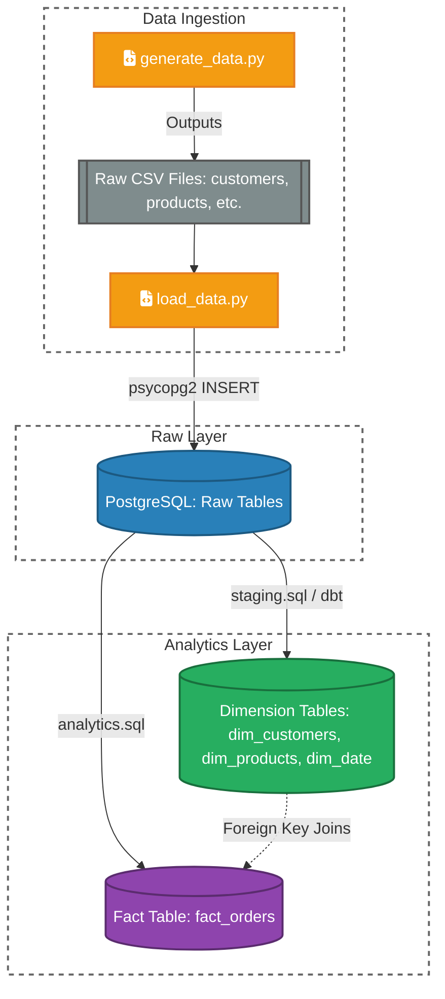

# Customer Sales Data Warehouse 🚀

An end-to-end Data Engineering (ETL/ELT) pipeline that generates highly realistic synthetic e-commerce data, ingests it into a PostgreSQL database, and transforms it into a highly optimized Star Schema for business analytics.

## 🛠️ Tech Stack
* **Programming:** Python 3 (Pandas, Faker, psycopg2)
* **Database:** PostgreSQL
* **Transformations:** SQL (dbt Core concepts)
* **Design Pattern:** Dimensional Modeling (Star Schema)

---

## 🏗️ Project Lifecycle

### 1. Data Generation (`generate_data.py`)
To simulate a real-world business, this script utilizes the Python `Faker` and `pandas` libraries to generate synthetic datasets.
* **Customers:** 5,000 unique records with realistic names, cities, and signup dates.
* **Products:** 300 electronic products categorized by brand and realistic price ranges.
* **Transactions:** Dynamic generation of orders and multiple order items per customer.
* **Output:** Saves as raw `.csv` files into a `/data/raw/` directory.

### 2. Data Ingestion (`load_data.py`)
* Establishes a connection to the PostgreSQL `customer_sales_dw` database using `psycopg2`.
* Reads the raw CSV files using `pandas` and uses `INSERT` statements to load data into the base public schema tables (`customers`, `products`, `orders`, `order_items`).

### 3. Data Transformation & Warehousing (`warehouse.sql` / `analytics.sql`)
* Translates highly normalized raw data into a **Star Schema** optimized for BI and analytics.
* **Dimensions:** Generates surrogate keys and populates `dim_customers`, `dim_products`, and a `dim_date` table broken down by year, quarter, month, and day.
* **Fact Table:** Performs complex SQL `JOIN` operations across staging tables to build `fact_orders`. 
* **Business Logic:** Automatically calculates analytical metrics on the fly, such as multiplying `quantity` by `price` to generate a final `sales` column.

---

## 🚀 How to Run Locally

### Prerequisites
* Python 3.8+
* PostgreSQL installed and running on `localhost`
* A database named `customer_sales_dw` with a user `postgres`

### Setup Instructions
1. **Clone the repository:**
   ```bash
   git clone [https://github.com/Dhairya0170/Customer-Sales-Data-Warehouse.git](https://github.com/Dhairya0170/Customer-Sales-Data-Warehouse.git)
   cd Customer-Sales-Data-Warehouse
   ```

2. **Install dependencies:**
   ```bash
   pip install pandas faker psycopg2
   ```

3. **Initialize the Database Schema:**
   Run the `schema.sql` file in your PostgreSQL environment to create the base tables.

4. **Generate Raw Data:**
   ```bash
   python scripts/generate_data.py
   ```
   *(This will create the `/data/raw/` folder and populate it with CSVs)*.

5. **Load Data to PostgreSQL:**
   ```bash
   python scripts/load_data.py
   ```

6. **Build the Data Warehouse:**
   Execute `warehouse.sql` and `analytics.sql` inside PostgreSQL to generate the Star Schema and populate the Fact/Dimension tables.

---

## 📊 Pipeline Architecture (Data Flow Diagram)



---
**Author:** [Dhairya Parmar](https://github.com/Dhairya0170)  
*GATE CSE 2026 Qualified | Computer Engineering Graduate*
